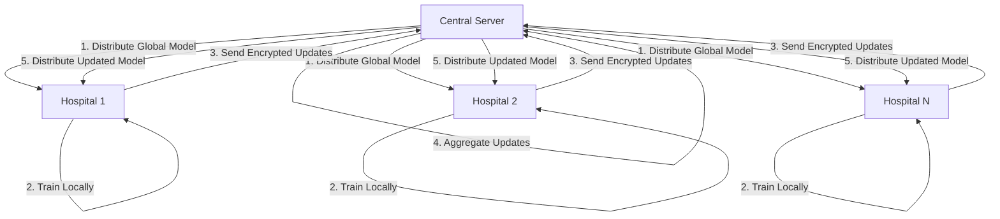

# Secure Federated Learning for Healthcare

## Problem Statement

### Background

In the healthcare sector, machine learning models are increasingly used for medical research, disease prediction, diagnosis, and treatment planning. These models require large and diverse patient datasets to work accurately. However, hospitals and medical institutions face strict privacy and legal regulations (such as data protection laws) that prevent them from sharing raw patient data with other hospitals or central servers.

### Current Challenges

Because of this restriction, each hospital usually trains machine learning models using only its own local data. This data often represents a limited population, region, or demographic group. As a result, the trained models can become:

- **Biased** - Limited to specific demographics
- **Less accurate** - Trained on smaller datasets
- **Unable to generalize** - Poor performance on diverse populations

This limitation slows down medical research and reduces the effectiveness of AI-based healthcare solutions.

## Proposed Solution: Secure Federated Learning (FL)

### Overview

Federated Learning allows multiple hospitals to collaboratively train a shared machine learning model without sharing raw patient data. In this system, each hospital keeps its patient data securely stored on its own servers.

### How It Works

### Process Flow

1. **Model Distribution**: A common machine learning model is shared with participating hospitals

2. **Local Training**: Each hospital trains the model locally using its own patient data

3. **Encrypted Update Transmission**: Instead of sending patient data, hospitals send encrypted model updates or weights to a central server

4. **Aggregation**: The central server aggregates these encrypted updates to improve the global model

5. **Model Update**: The updated global model is sent back to the hospitals for further training

By repeating this process, the model learns from data across multiple hospitals while maintaining patient privacy.

## Benefits

### Privacy Protection
- Raw patient data never leaves the hospital
- Privacy risks are minimized
- Compliance with data protection regulations (HIPAA, GDPR, etc.)

### Improved Model Performance
- Model benefits from diverse datasets across multiple institutions
- Reduced bias from limited local data
- Better generalization to different patient populations
- Improved accuracy through collaborative learning

### Accelerated Medical Research
- Enables large-scale collaborative research without data sharing
- Faster development of AI-based healthcare solutions
- Better treatment planning and diagnosis capabilities

## Summary

The problem lies in **balancing data privacy with the need for collaborative learning in healthcare**. A Secure Federated Learning system solves this problem by enabling hospitals to jointly train powerful machine learning models while keeping sensitive patient data private and secure.

---

## Getting Started

*[Add implementation details, requirements, and setup instructions here]*

## Contributing

*[Add contribution guidelines here]*

## License

*[Add license information here]*
